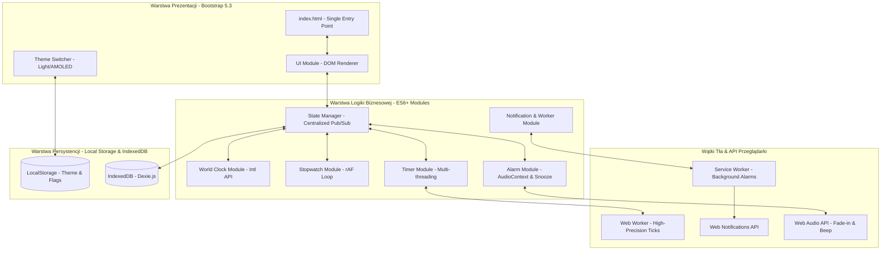
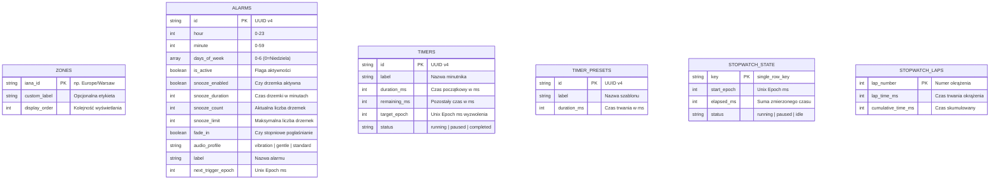
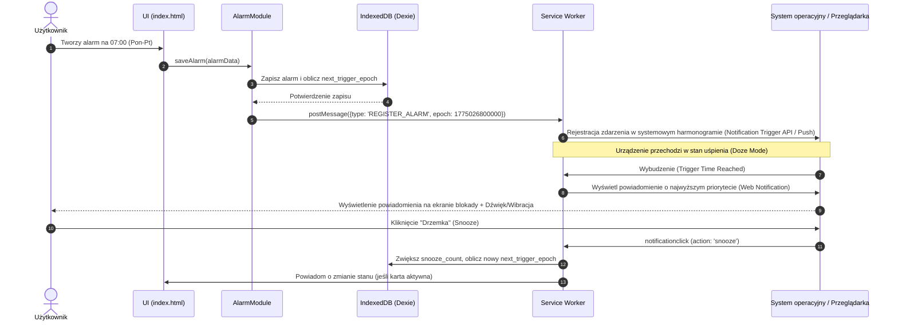
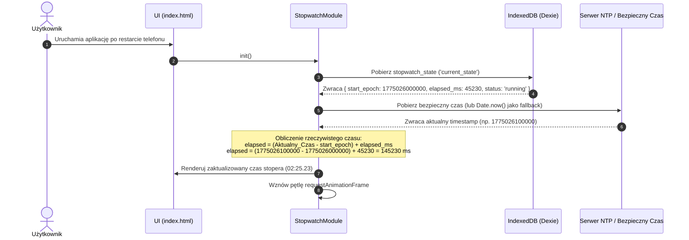

# SYSTEM DESIGN DOCUMENT (SDD)
## Projekt: ChronosApp — Nowoczesna Aplikacja Zegara i Alertyzacji
**Wersja:** 1.0  
**Status:** Gotowy do wdrożenia  
**Data:** 31 maja 2026 r.  
**Autor:** Starszy Analityk Systemowy (Senior Systems Analyst)  
**Dla zespołu:** Product Manager, Architekt Oprogramowania, Zespół Deweloperski, QA  

---

## Spis Treści
1. [Wprowadzenie i Architektura Systemu](#1-wprowadzenie-i-architektura-systemu)
2. [Model Danych i Struktura IndexedDB](#2-model-danych-i-struktura-indexeddb)
3. [Architektura Modułowa i Kontrakty JS](#3-architektura-modułowa-i-kontrakty-js)
4. [Przepływy Procesowe i Diagramy Sekwencji](#4-przepływy-procesowe-i-diagramy-sekwencji)
5. [Obsługa Przypadków Brzegowych w Środowisku Przeglądarki](#5-obsługa-przypadków-brzegowych-w-środowisku-przeglądarki)
6. [Wymagania Niefunkcjonalne (NFR) i Implementacja UI/UX](#6-wymagania-niefunkcjonalne-nfr-i-implementacja-uiux)
7. [Matryca Pokrycia Wymagań Technicznych](#7-matryca-pokrycia-wymagań-technicznych)

---

## 1. Wprowadzenie i Architektura Systemu

### 1.1. Założenia Architektoniczne (Local-First SPA)
ChronosApp jest zaprojektowana jako **Local-First Single-Page Application (SPA)**. Oznacza to, że cała logika biznesowa, zarządzanie stanem, obliczenia czasowe oraz renderowanie interfejsu użytkownika odbywają się bezpośrednio w przeglądarce klienta. Aplikacja nie posiada dedykowanego backendu bazodanowego ani serwera aplikacyjnego – cała persystencja opiera się na lokalnych mechanizmach przeglądarki (IndexedDB oraz LocalStorage).

Aplikacja jest dystrybuowana jako pojedynczy, zoptymalizowany plik HTML (lub kompilowana do jednego punktu wejścia z modułów ES6+), co gwarantuje natychmiastowe ładowanie, brak opóźnień sieciowych (Layout Shifts) oraz pełną funkcjonalność w trybie offline.

### 1.2. Diagram Architektury Systemowej
Poniższy diagram przedstawia architekturę warstwową aplikacji oraz przepływ danych pomiędzy modułami a pamięcią przeglądarki.



---

## 2. Model Danych i Struktura IndexedDB

Do przechowywania stanu aplikacji wykorzystywana jest baza danych **IndexedDB**, zarządzana za pomocą biblioteki **Dexie.js** (lekki, obietnicowy wrapper zapewniający asynchroniczność i transakcyjność). 

### 2.1. Diagram Związków Encji (ERD)
Poniższy diagram ERD przedstawia strukturę tabel (Object Stores) w bazie danych `ChronosDB`.



### 2.2. Specyfikacja Tabel (Object Stores) i Schematy JSON

Baza danych inicjalizowana jest jako `ChronosDB` w wersji `1`. Poniżej znajdują się szczegółowe definicje struktur danych.

#### 2.2.1. Tabela `zones` (Czas Światowy)
Przechowuje wybrane przez użytkownika strefy czasowe (maksymalnie 10, zgodnie z regułą **BR-01**).

*   **Klucz główny:** `iana_id` (string)
*   **Schemat TypeScript:**
```typescript
interface ZoneEntity {
  iana_id: string;        // np. "America/New_York", "Asia/Tokyo"
  custom_label?: string;  // Opcjonalna nazwa własna nadana przez użytkownika
  display_order: number;  // Indeks sortowania (0-9)
}
```
*   **Przykładowy rekord JSON:**
```json
{
  "iana_id": "Europe/Warsaw",
  "custom_label": "Biuro Główne",
  "display_order": 0
}
```

#### 2.2.2. Tabela `alarms` (Inteligentne Alarmy)
Przechowuje konfigurację alarmów jednorazowych i cyklicznych.

*   **Klucz główny:** `id` (string, UUID v4)
*   **Indeksy:** `next_trigger_epoch`, `is_active`
*   **Schemat TypeScript:**
```typescript
interface AlarmEntity {
  id: string;
  hour: number;                  // 0-23
  minute: number;                // 0-59
  days_of_week: number[];        // Tablica dni tygodnia: 0 (Niedziela) do 6 (Sobota). Pusta = jednorazowy.
  is_active: boolean;            // Czy alarm jest włączony
  snooze_enabled: boolean;       // Czy drzemka jest dozwolona
  snooze_duration: number;       // Czas drzemki w minutach (np. 9)
  snooze_count: number;          // Aktualnie wykorzystane drzemki
  snooze_limit: number;          // Maksymalna liczba drzemek (np. 3)
  fade_in: boolean;              // Czy stosować liniowe pogłaśnianie (15s)
  audio_profile: 'vibration' | 'gentle' | 'standard'; // Profil dźwiękowy
  label: string;                 // Etykieta alarmu
  next_trigger_epoch: number;    // Unix Epoch ms kolejnego wyzwolenia (do planowania w tle)
}
```
*   **Przykładowy rekord JSON:**
```json
{
  "id": "f47ac10b-58cc-4372-a567-0e02b2c3d479",
  "hour": 7,
  "minute": 0,
  "days_of_week": [1, 2, 3, 4, 5],
  "is_active": true,
  "snooze_enabled": true,
  "snooze_duration": 9,
  "snooze_count": 0,
  "snooze_limit": 3,
  "fade_in": true,
  "audio_profile": "standard",
  "label": "Pobudka Praca",
  "next_trigger_epoch": 1775026800000
}
```

#### 2.2.3. Tabela `timers` (Wielowątkowe Minutniki)
Przechowuje stan aktywnych minutników (maksymalnie 5, zgodnie z regułą **BR-02**).

*   **Klucz główny:** `id` (string, UUID v4)
*   **Schemat TypeScript:**
```typescript
interface TimerEntity {
  id: string;
  label: string;                 // Etykieta minutnika (np. "Pieczenie ciasta")
  duration_ms: number;           // Początkowy czas trwania w milisekundach
  remaining_ms: number;          // Pozostały czas w milisekundach
  target_epoch: number;          // Unix Epoch ms, kiedy minutnik powinien się zakończyć (0 jeśli zapauzowany)
  status: 'running' | 'paused' | 'completed';
}
```
*   **Przykładowy rekord JSON:**
```json
{
  "id": "a89bc31d-1234-4321-b567-9f01b2c3d480",
  "label": "Gotowanie jajek",
  "duration_ms": 300000,
  "remaining_ms": 124500,
  "target_epoch": 1775027424500,
  "status": "running"
}
```

#### 2.2.4. Tabela `timer_presets` (Szablony Minutników)
Przechowuje zdefiniowane szablony szybkiego wyboru.

*   **Klucz główny:** `id` (string, UUID v4)
*   **Schemat TypeScript:**
```typescript
interface TimerPresetEntity {
  id: string;
  label: string;
  duration_ms: number;
}
```

#### 2.2.5. Tabela `stopwatch_state` (Stan Stopera)
Przechowuje globalny stan stopera w celu zapewnienia ciągłości pomiaru po restarcie (wymaganie **US-2.4**). Zawiera zawsze dokładnie jeden rekord.

*   **Klucz główny:** `key` (string, stała wartość `"current_state"`)
*   **Schemat TypeScript:**
```typescript
interface StopwatchStateEntity {
  key: 'current_state';
  start_epoch: number;           // Unix Epoch ms rozpoczęcia/wznowienia (0 jeśli nieaktywny)
  elapsed_ms: number;            // Skumulowany czas z poprzednich sesji przed pauzą
  status: 'running' | 'paused' | 'idle';
}
```
*   **Przykładowy rekord JSON:**
```json
{
  "key": "current_state",
  "start_epoch": 1775026000000,
  "elapsed_ms": 45230,
  "status": "running"
}
```

#### 2.2.6. Tabela `stopwatch_laps` (Okrążenia Stopera)
Przechowuje listę zarejestrowanych okrążeń stopera.

*   **Klucz główny:** `lap_number` (number)
*   **Schemat TypeScript:**
```typescript
interface StopwatchLapEntity {
  lap_number: number;            // Numer okrążenia (1, 2, 3...)
  lap_time_ms: number;           // Czas trwania tego okrążenia
  cumulative_time_ms: number;    // Czas całkowity stopera w momencie zapisu okrążenia
}
```

---

## 3. Architektura Modułowa i Kontrakty JS

Aplikacja ChronosApp zorganizowana jest w moduły ES6+. Poniżej zdefiniowano interfejsy programistyczne (API) dla kluczowych modułów logicznych. Wszystkie operacje I/O na bazie danych są asynchroniczne i wykorzystują `async/await`.

### 3.1. DatabaseModule (`db.js`)
Odpowiada za inicjalizację bazy danych Dexie.js oraz podstawowe operacje CRUD.

```javascript
import Dexie from 'dexie';

class ChronosDatabase extends Dexie {
  constructor() {
    super('ChronosDB');
    this.version(1).stores({
      zones: 'iana_id, display_order',
      alarms: 'id, next_trigger_epoch, is_active',
      timers: 'id, status',
      timer_presets: 'id',
      stopwatch_state: 'key',
      stopwatch_laps: 'lap_number'
    });
  }
}

export const db = new ChronosDatabase();
```

### 3.2. StateModule (`state.js`)
Centralny zarządca stanu aplikacji implementujący wzorzec Pub/Sub (Obserwator). Zapobiega bezpośredniemu wiązaniu logiki z widokiem (zgodnie z **NFR-02-02**).

```javascript
export class StateManager {
  constructor() {
    this.listeners = {}; // Słownik: { event_name: [callback1, callback2] }
  }

  subscribe(event, callback) {
    if (!this.listeners[event]) {
      this.listeners[event] = [];
    }
    this.listeners[event].push(callback);
    return () => this.unsubscribe(event, callback);
  }

  unsubscribe(event, callback) {
    if (!this.listeners[event]) return;
    this.listeners[event] = this.listeners[event].filter(cb => cb !== callback);
  }

  notify(event, data) {
    if (!this.listeners[event]) return;
    this.listeners[event].forEach(callback => callback(data));
  }
}
```

### 3.3. ClockModule (`clock.js`)
Odpowiada za pobieranie czasu lokalnego, obsługę stref czasowych oraz walidację limitu stref (maksymalnie 10).

```javascript
export class ClockModule {
  /**
   * Pobiera aktualny czas sformatowany dla danej strefy IANA.
   * @param {string} ianaId - Identyfikator strefy np. "Europe/Warsaw"
   * @returns {Object} { timeString, dateString, offsetString }
   */
  static getTimeForZone(ianaId) {
    const now = new Date();
    
    const timeFormatter = new Intl.DateTimeFormat('pl-PL', {
      timeZone: ianaId,
      hour: '2-digit',
      minute: '2-digit',
      second: '2-digit',
      hour12: false
    });

    const dateFormatter = new Intl.DateTimeFormat('pl-PL', {
      timeZone: ianaId,
      year: 'numeric',
      month: '2-digit',
      day: '2-digit'
    });

    // Obliczanie offsetu (różnicy czasu) względem strefy lokalnej
    const localOffset = now.getTimezoneOffset(); // w minutach
    const tempString = now.toLocaleString('en-US', { timeZone: ianaId });
    const zoneDate = new Date(tempString);
    const diffMs = zoneDate.getTime() - now.getTime();
    const diffHours = Math.round(diffMs / (1000 * 60 * 60));

    return {
      timeString: timeFormatter.format(now),
      dateString: dateFormatter.format(now),
      offsetString: diffHours >= 0 ? `+${diffHours}h` : `${diffHours}h`
    };
  }

  /**
   * Dodaje nową strefę czasową do listy użytkownika z zachowaniem limitu 10 stref (BR-01).
   * @param {string} ianaId 
   * @returns {Promise<boolean>} true jeśli dodano pomyślnie
   */
  async addZone(ianaId) {
    const count = await db.zones.count();
    if (count >= 10) {
      throw new Error("Osiągnięto maksymalny limit 10 stref czasowych.");
    }
    await db.zones.put({
      iana_id: ianaId,
      display_order: count
    });
    return true;
  }
}
```

### 3.4. StopwatchModule (`stopwatch.js`)
Odpowiada za precyzyjny pomiar czasu (0.01s) z wykorzystaniem pętli `requestAnimationFrame` oraz automatyczną analitykę okrążeń (ekstrema).

```javascript
export class StopwatchModule {
  constructor(stateManager) {
    this.stateManager = stateManager;
    this.animationFrameId = null;
    this.isRunning = false;
  }

  /**
   * Inicjalizuje stoper, odtwarzając stan z bazy danych po restarcie (US-2.4).
   */
  async init() {
    const state = await db.stopwatch_state.get('current_state');
    if (state && state.status === 'running') {
      this.isRunning = true;
      this.startLoop();
    }
  }

  /**
   * Uruchamia stoper i zapisuje stan w IndexedDB.
   */
  async start() {
    const now = Date.now();
    const state = await db.stopwatch_state.get('current_state') || { elapsed_ms: 0 };
    
    const newState = {
      key: 'current_state',
      start_epoch: now,
      elapsed_ms: state.elapsed_ms,
      status: 'running'
    };
    
    await db.stopwatch_state.put(newState);
    this.isRunning = true;
    this.startLoop();
    this.stateManager.notify('stopwatch_changed', newState);
  }

  /**
   * Pauzuje stoper i utrwala zmierzony czas.
   */
  async pause() {
    const now = Date.now();
    const state = await db.stopwatch_state.get('current_state');
    if (!state || state.status !== 'running') return;

    const sessionElapsed = now - state.start_epoch;
    const totalElapsed = state.elapsed_ms + sessionElapsed;

    const newState = {
      key: 'current_state',
      start_epoch: 0,
      elapsed_ms: totalElapsed,
      status: 'paused'
    };

    await db.stopwatch_state.put(newState);
    this.isRunning = false;
    cancelAnimationFrame(this.animationFrameId);
    this.stateManager.notify('stopwatch_changed', newState);
  }

  startLoop() {
    const tick = () => {
      if (!this.isRunning) return;
      this.stateManager.notify('stopwatch_tick', this.getCalculatedTime());
      this.animationFrameId = requestAnimationFrame(tick);
    };
    this.animationFrameId = requestAnimationFrame(tick);
  }

  /**
   * Oblicza ekstrema (najszybsze/najwolniejsze okrążenie) - wymaganie US-2.3.
   * @param {Array} laps - Lista okrążeń z bazy danych
   * @returns {Object} { fastestLapNumber, slowestLapNumber }
   */
  static analyzeLaps(laps) {
    if (laps.length < 3) return { fastest: null, slowest: null };

    let fastest = laps[0];
    let slowest = laps[0];

    laps.forEach(lap => {
      if (lap.lap_time_ms < fastest.lap_time_ms) fastest = lap;
      if (lap.lap_time_ms > slowest.lap_time_ms) slowest = lap;
    });

    return {
      fastest: fastest.lap_number,
      slowest: slowest.lap_number
    };
  }
}
```

### 3.5. TimerModule (`timer.js`)
Zarządza wieloma minutnikami (maksymalnie 5) i komunikuje się z Web Workerem w celu zapewnienia dokładności odliczania w tle.

```javascript
export class TimerModule {
  /**
   * Tworzy i uruchamia nowy minutnik (BR-02).
   * @param {string} label - Etykieta minutnika
   * @param {number} durationMs - Czas trwania w ms
   */
  async createTimer(label, durationMs) {
    const activeCount = await db.timers.where('status').anyOf('running', 'paused').count();
    if (activeCount >= 5) {
      throw new Error("Możesz uruchomić maksymalnie 5 minutników jednocześnie.");
    }

    const id = crypto.randomUUID();
    const targetEpoch = Date.now() + durationMs;

    const newTimer = {
      id,
      label,
      duration_ms: durationMs,
      remaining_ms: durationMs,
      target_epoch: targetEpoch,
      status: 'running'
    };

    await db.timers.put(newTimer);
    this.registerBackgroundNotification(newTimer);
    return newTimer;
  }

  /**
   * Rejestruje powiadomienie w Service Workerze na wypadek uśpienia karty (US-3.3).
   */
  registerBackgroundNotification(timer) {
    if ('serviceWorker' in navigator && Notification.permission === 'granted') {
      navigator.serviceWorker.ready.then(registration => {
        registration.active.postMessage({
          type: 'SCHEDULE_TIMER',
          id: timer.id,
          label: timer.label,
          triggerAt: timer.target_epoch
        });
      });
    }
  }
}
```

### 3.6. AlarmModule (`alarm.js`)
Odpowiada za harmonogramowanie alarmów, obsługę drzemek, stopniowe pogłaśnianie (Fade-in) oraz obsługę konfliktów audio.

```javascript
export class AlarmModule {
  constructor() {
    this.audioContext = null;
    this.gainNode = null;
    this.oscillator = null;
  }

  /**
   * Inicjalizuje Web Audio API do generowania dźwięku alarmu (niezależność od plików zewnętrznych).
   */
  initAudio() {
    const AudioContextClass = window.AudioContext || window.webkitAudioContext;
    this.audioContext = new AudioContextClass();
    this.gainNode = this.audioContext.createGain();
    this.gainNode.connect(this.audioContext.destination);
  }

  /**
   * Uruchamia dźwięk alarmu z liniowym pogłaśnianiem (Fade-in) w 15 sekund (US-4.3).
   */
  playAlarmSound(profile) {
    if (!this.audioContext) this.initAudio();
    
    if (profile === 'vibration') {
      this.triggerVibrationPattern();
      return;
    }

    // Konfiguracja oscylatora (dźwięk alarmu)
    this.oscillator = this.audioContext.createOscillator();
    this.oscillator.type = 'sine';
    this.oscillator.frequency.setValueAtTime(880, this.audioContext.currentTime); // Dźwięk A5
    this.oscillator.connect(this.gainNode);

    // Gradacja głośności (Fade-in) - US-4.3
    const startVolume = 0.1;
    const targetVolume = 1.0;
    const fadeDuration = 15; // sekund

    this.gainNode.gain.setValueAtTime(startVolume, this.audioContext.currentTime);
    this.gainNode.gain.linearRampToValueAtTime(targetVolume, this.audioContext.currentTime + fadeDuration);

    this.oscillator.start();
    this.triggerVibrationPattern();
  }

  triggerVibrationPattern() {
    if ('vibrate' in navigator) {
      // Cykl: wibracja 500ms, przerwa 250ms, wibracja 500ms...
      navigator.vibrate([500, 250, 500, 250, 500]);
    }
  }

  stopAlarm() {
    if (this.oscillator) {
      this.oscillator.stop();
      this.oscillator.disconnect();
      this.oscillator = null;
    }
    if ('vibrate' in navigator) {
      navigator.vibrate(0); // Zatrzymanie wibracji
    }
  }
}
```

---

## 4. Przepływy Procesowe i Diagramy Sekwencji

### 4.1. Wyzwolenie Alarmu w Tle (Service Worker & Web Notifications)
Poniższy diagram przedstawia proces wyzwalania alarmu, gdy aplikacja jest zminimalizowana, a karta przeglądarki uśpiona.



### 4.2. Odzyskiwanie Stanu Stopera po Restarcie Urządzenia
Proces gwarantujący ciągłość pomiaru czasu stopera po nagłym wyłączeniu urządzenia (np. rozładowanie baterii).



---

## 5. Obsługa Przypadków Brzegowych w Środowisku Przeglądarki

Środowisko przeglądarkowe nakłada specyficzne ograniczenia techniczne. Poniżej opisano rozwiązania architektoniczne dla zidentyfikowanych przypadków brzegowych.

### 5.1. Zmiana Czasu (DST)
*   **Problem:** Przejście z czasu letniego na zimowy (lub odwrotnie) w trakcie odliczania minutnika lub tuż przed wyzwoleniem alarmu.
*   **Rozwiązanie:** 
    *   Wszystkie wewnętrzne obliczenia czasu trwania procesów (stoper, minutnik) oraz harmonogramowanie alarmów opierają się na **bezwzględnych znacznikach czasu Unix Epoch (milisekundach)**. Unix Epoch jest liniowy i całkowicie niezależny od stref czasowych oraz zmian DST.
    *   Wyświetlanie czasu dla stref czasowych w module World Clock realizowane jest dynamicznie przy użyciu natywnego API `Intl.DateTimeFormat` z parametrem `timeZone`. Przeglądarka automatycznie aplikuje poprawne reguły DST na podstawie wbudowanej bazy danych IANA.

### 5.2. Ograniczenia Wykonywania Kodu w Tle (Tab Suspension / Doze Mode)
*   **Problem:** Przeglądarki drastycznie ograniczają wykonywanie kodu JavaScript (w tym `setInterval` i `setTimeout`) w nieaktywnych kartach (background throttling) w celu oszczędzania baterii.
*   **Rozwiązanie:**
    1.  **Web Workers:** Do odliczania czasu w stoperze i minutnikach, gdy karta jest aktywna, ale użytkownik przełączył się na inny element UI, stosowany jest dedykowany wątek roboczy (Web Worker). Web Workery nie podlegają tak drastycznemu dławieniu jak główny wątek UI.
    2.  **Page Visibility API:** Przy zmianie stanu karty na widoczną (`visibilitychange` event), aplikacja natychmiast synchronizuje stan wszystkich liczników z bazą danych IndexedDB, obliczając różnicę czasu na podstawie `Date.now()`. Zapobiega to efektowi "zamrożenia" interfejsu.
    3.  **Service Worker + Notification Triggers:** Dla minutników i alarmów, które muszą wyzwolić się, gdy aplikacja jest całkowicie zamknięta, rejestrowane jest zdarzenie w Service Workerze. Service Worker działa w osobnym procesie systemowym i potrafi wybudzić urządzenie oraz wyświetlić powiadomienie lokalne (Web Notification) nawet przy zamkniętej przeglądarce.

### 5.3. Blokada Autoplay (Autoplay Policy) i Konflikty Audio
*   **Problem:** Nowoczesne przeglądarki blokują odtwarzanie dźwięków (Web Audio API / HTML5 Audio) bez uprzedniej interakcji użytkownika ze stroną (np. kliknięcia). Dodatkowo, alarm może wyzwolić się podczas aktywnego połączenia telefonicznego.
*   **Rozwiązanie:**
    *   **Autoplay Bypass:** Przy pierwszym uruchomieniu aplikacji użytkownik musi wejść w interakcję z interfejsem (np. kliknąć przycisk "Zezwól na powiadomienia i dźwięki"). Ta interakcja odblokowuje `AudioContext`. Stan odblokowania jest zapisywany w `LocalStorage` jako flaga `audio_unlocked=true`.
    *   **Obsługa Połączeń Telefonicznych (Audio Focus):** Przed odtworzeniem dźwięku alarmu, moduł `AlarmModule` sprawdza stan wyciszenia oraz próbuje uzyskać wyłączny dostęp do wyjścia audio (Audio Focus). Jeśli system operacyjny zgłosi, że linia audio jest zajęta (np. aktywne połączenie telefoniczne), aplikacja:
        1.  Rezygnuje z odtwarzania głośnego dźwięku przez głośnik zewnętrzny.
        2.  Generuje delikatny, przerywany sygnał o niskiej częstotliwości (beeping) bezpośrednio w kanale słuchawkowym.
        3.  Uruchamia intensywne wibracje urządzenia za pomocą `navigator.vibrate()`.

---

## 6. Wymagania Niefunkcjonalne (NFR) i Implementacja UI/UX

### 6.1. Kontrola Motywów (AMOLED Black vs Light Mode)
Aplikacja w pełni wspiera natywne motywy **Bootstrap 5.3+** za pomocą atrybutu `data-bs-theme`.

#### 6.1.1. Specyfikacja Kolorystyczna AMOLED Black (`theme="dark"`)
Zaprojektowana z myślą o maksymalnym oszczędzaniu energii na ekranach OLED/AMOLED (zgodnie z **NFR-01-01**).

| Element interfejsu | Właściwość CSS | Wartość HEX | Opis |
| :--- | :--- | :--- | :--- |
| **Główne tło aplikacji** | `background-color` | `#000000` | Czysta czerń (wyłączone piksele) |
| **Karty, panele, modale** | `background-color` | `#121212` | Bardzo ciemna szarość dla zachowania głębi |
| **Tekst główny** | `color` | `#FFFFFF` | Maksymalny kontrast i czytelność |
| **Tekst pomocniczy** | `color` | `#A0A0A0` | Stonowana szarość |
| **Akcent (Najszybsze okrążenie)** | `color` / `border` | `#2ECC71` | Jasna zieleń (kontrast > 4.5:1) |
| **Akcent (Najwolniejsze okrążenie)**| `color` / `border` | `#E74C3C` | Jasna czerwień (kontrast > 4.5:1) |

#### 6.1.2. Specyfikacja Kolorystyczna Light Mode (`theme="light"`)
Zapewnia doskonałą czytelność w pełnym słońcu (zgodnie z **NFR-01-02**).

| Element interfejsu | Właściwość CSS | Wartość HEX | Opis |
| :--- | :--- | :--- | :--- |
| **Główne tło aplikacji** | `background-color` | `#F8F9FA` | Złamana biel |
| **Karty, panele, modale** | `background-color` | `#FFFFFF` | Czysta biel |
| **Tekst główny** | `color` | `#1A1A1A` | Głęboka ciemna szarość |
| **Tekst pomocniczy** | `color` | `#6C757D` | Standardowa szarość Bootstrap |

#### 6.1.3. Logika Przełącznika Motywów
Wybrany motyw jest zapisywany w `LocalStorage` pod kluczem `chronos_theme`. Przy starcie aplikacja wykonuje następującą logikę:

```javascript
function applyTheme() {
  const savedTheme = localStorage.getItem('chronos_theme') || 'system';
  let themeToApply = savedTheme;

  if (savedTheme === 'system') {
    const prefersDark = window.matchMedia('(prefers-color-scheme: dark)').matches;
    themeToApply = prefersDark ? 'dark' : 'light';
  }

  document.documentElement.setAttribute('data-bs-theme', themeToApply);
  
  // Dodatkowa klasa dla AMOLED Black
  if (themeToApply === 'dark') {
    document.body.classList.add('amoled-black');
  } else {
    document.body.classList.remove('amoled-black');
  }
}
```

### 6.2. Dostępność (A11Y)
Aplikacja spełnia wytyczne **WCAG 2.1 AA**:
*   **Nawigacja Klawiaturą:** Wszystkie elementy interaktywne (przyciski, pola wyboru, zakładki) posiadają wyraźny stan skupienia (`:focus-visible`) i są dostępne za pomocą klawisza `Tab`.
*   **Atrybuty ARIA:** Każdy dynamiczny komponent posiada odpowiednie deskryptory, np. `aria-live="polite"` dla wyświetlacza stopera i minutnika, aby czytniki ekranu na bieżąco informowały o zmianach stanu bez rozpraszania użytkownika.
*   **Semantyka HTML5:** Struktura dokumentu opiera się na tagach `<header>`, `<main>`, `<section>` oraz `<nav>`.

### 6.3. Responsywność (Mobile-First)
Interfejs jest w pełni responsywny i zoptymalizowany pod kątem urządzeń mobilnych:
*   **Siatka:** Wykorzystanie systemu `col-12 col-md-6 col-lg-4` z Bootstrap 5.3.
*   **Obszar dotyku (Touch Targets):** Wszystkie przyciski kontrolne (Start, Pauza, Okrążenie) mają minimalny rozmiar `48px x 48px` oraz margines bezpieczeństwa `8px`, zapobiegając przypadkowym kliknięciom.

---

## 7. Matryca Pokrycia Wymagań Technicznych

Poniższa tabela mapuje wymagania biznesowe z dokumentu BRD na konkretne rozwiązania techniczne i moduły zaimplementowane w niniejszym dokumencie SDD.

| ID Wymagania (BRD) | Nazwa Wymagania | Rozwiązanie Techniczne (SDD) | Status |
| :--- | :--- | :--- | :--- |
| **US-1.1** | Autodetekcja strefy | `ClockModule.getTimeForZone` + `Intl.DateTimeFormat` | **Zaprojektowane** |
| **US-1.2** | Obsługa zmian czasu (DST) | Przechowywanie czasu w Unix Epoch ms + `Intl` API | **Zaprojektowane** |
| **US-1.3** | Wyszukiwanie stref | Autouzupełnianie w UI na podstawie statycznej listy IANA | **Zaprojektowane** |
| **US-1.4** | Limit 10 stref | Walidacja w `ClockModule.addZone` (tabela `zones` w IndexedDB) | **Zaprojektowane** |
| **US-2.1** | Dokładność stopera (0.01s) | `StopwatchModule` + pętla `requestAnimationFrame` | **Zaprojektowane** |
| **US-2.2** | Rejestrowanie międzyczasów | Tabela `stopwatch_laps` w IndexedDB | **Zaprojektowane** |
| **US-2.3** | Analityka okrążeń | Metoda statyczna `StopwatchModule.analyzeLaps` | **Zaprojektowane** |
| **US-2.4** | Ciągłość pomiaru stopera | Tabela `stopwatch_state` + algorytm odzyskiwania stanu | **Zaprojektowane** |
| **US-3.1** | Limit 5 minutników | Walidacja w `TimerModule.createTimer` (tabela `timers`) | **Zaprojektowane** |
| **US-3.2** | Szablony minutników | Tabela `timer_presets` w IndexedDB | **Zaprojektowane** |
| **US-3.3** | Powiadomienia w tle | Service Worker + Web Notifications API | **Zaprojektowane** |
| **US-4.1** | Harmonogram alarmów | Tabela `alarms` + pole `next_trigger_epoch` | **Zaprojektowane** |
| **US-4.2** | Mechanizm drzemki | Pola `snooze_count` i `snooze_limit` w tabeli `alarms` | **Zaprojektowane** |
| **US-4.3** | Gradacja głośności (Fade-in) | `AlarmModule.playAlarmSound` + `AudioContext.gainNode` | **Zaprojektowane** |
| **US-4.4** | Tryb dyskretny i konflikty | `navigator.vibrate` + detekcja Audio Focus / Call State | **Zaprojektowane** |
| **US-4.5** | Niezawodność po restarcie | Service Worker wybudzany przez systemowe triggery | **Zaprojektowane** |
| **US-5.1** | Tryb Ciemny (AMOLED) | Klasa `.amoled-black` + tło `#000000` + Bootstrap 5.3 | **Zaprojektowane** |
| **US-5.2** | Tryb Jasny | Tło `#F8F9FA` + zgodność z WCAG 2.1 AA (kontrast 4.5:1) | **Zaprojektowane** |
| **US-5.3** | Przełącznik motywów | Funkcja `applyTheme` + zapis w `LocalStorage` | **Zaprojektowane** |
| **US-5.4** | Trwałość danych | Pełna integracja z IndexedDB za pomocą Dexie.js | **Zaprojektowane** |

---
*Dokument zatwierdzony do implementacji przez Starszego Analityka Systemowego.*
